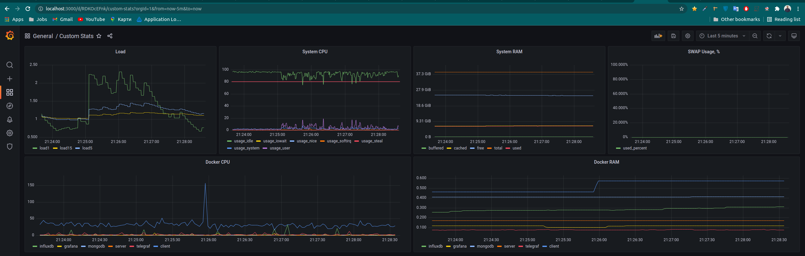

### Setup

1. Install docker
2. Install apache bench

## Steps to run

1. `sudo chown $USER /var/run/docker.sock` (allow telegraf to work with docker.sock)
2. `docker-compose up --build` 
3. When all services are up -- upload default configs (grafana dashboard, datasource and init data) by running `./run.sh`
4. open grafana: [http://localhost:3000/](http://localhost:3000/) (admin/admin) => Dashboards => Manage => select "Custom Stats" dashboard 
5. run ab test for details: `ab -n 5000 -c 500 -g ab_out.txt http://localhost/`

### Result

